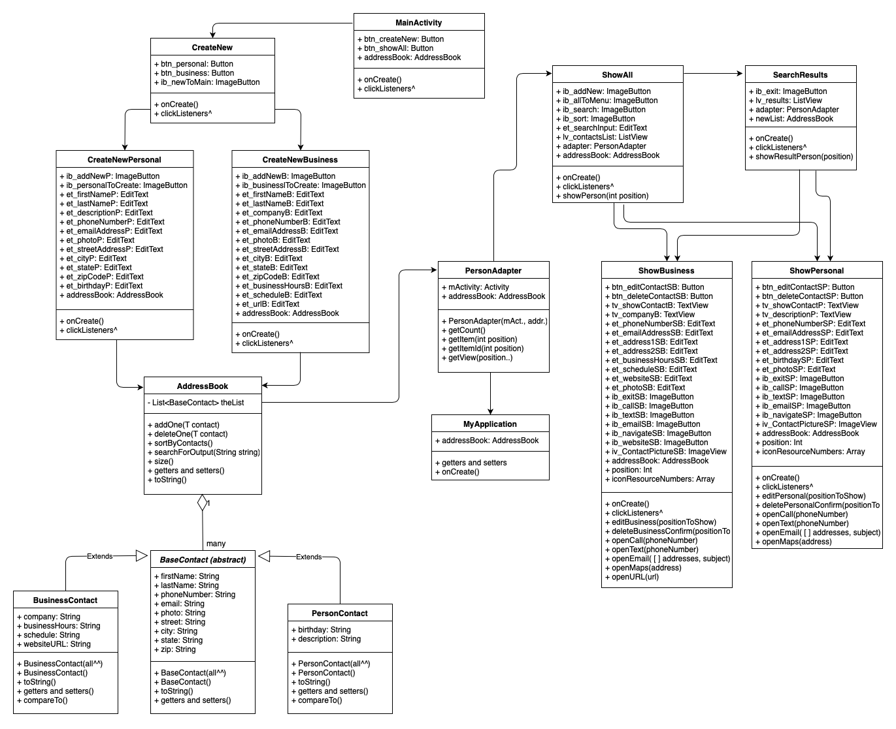
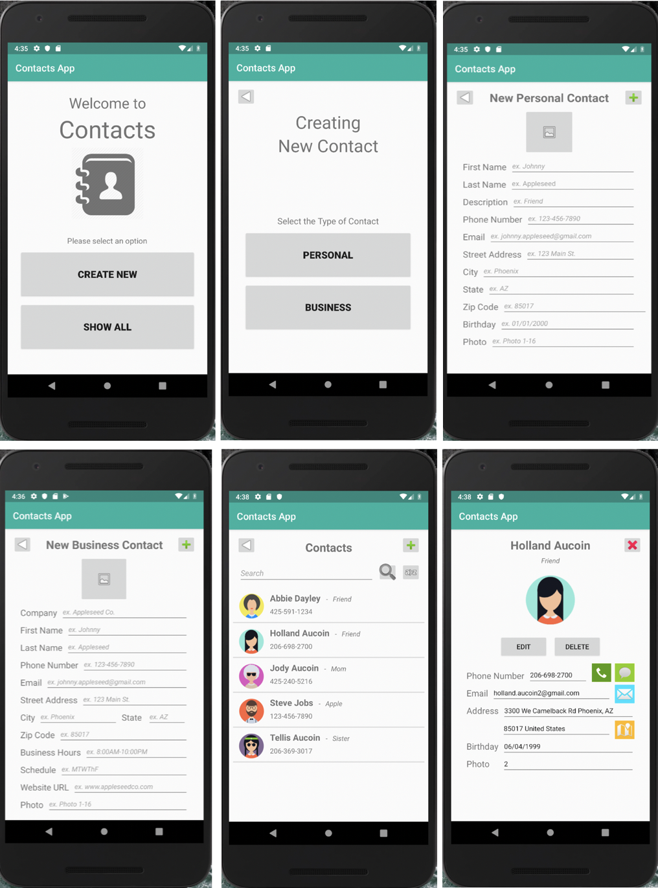

# Contacts Application

Using Android Studio, this application replicates a standard contacts app where a user is able to add, edit, and delete personal and business contacts, as well as search and sort those contacts.

<h2>Design</h2>

The planning for this assignment took a significant amount of work with UML’s, wireframes, and using eclipse to build the foundation. The UML’s helped outline the relationship between classes as well as the necessary variables and components, making it easier to code. The wireframes helped on the visual side as I was able to imagine how I wanted each layout to look, including all of the buttons and other details. Although my final product strongly differs from my original plan, it was useful to create the logistics of the app before attempting to execute.

<h3>Eclipse UML Diagram</h3>

	

<h3>Android Studio UML Diagram<h3>

	

# Product

<h3>Digital Wireframes<h3>

	

