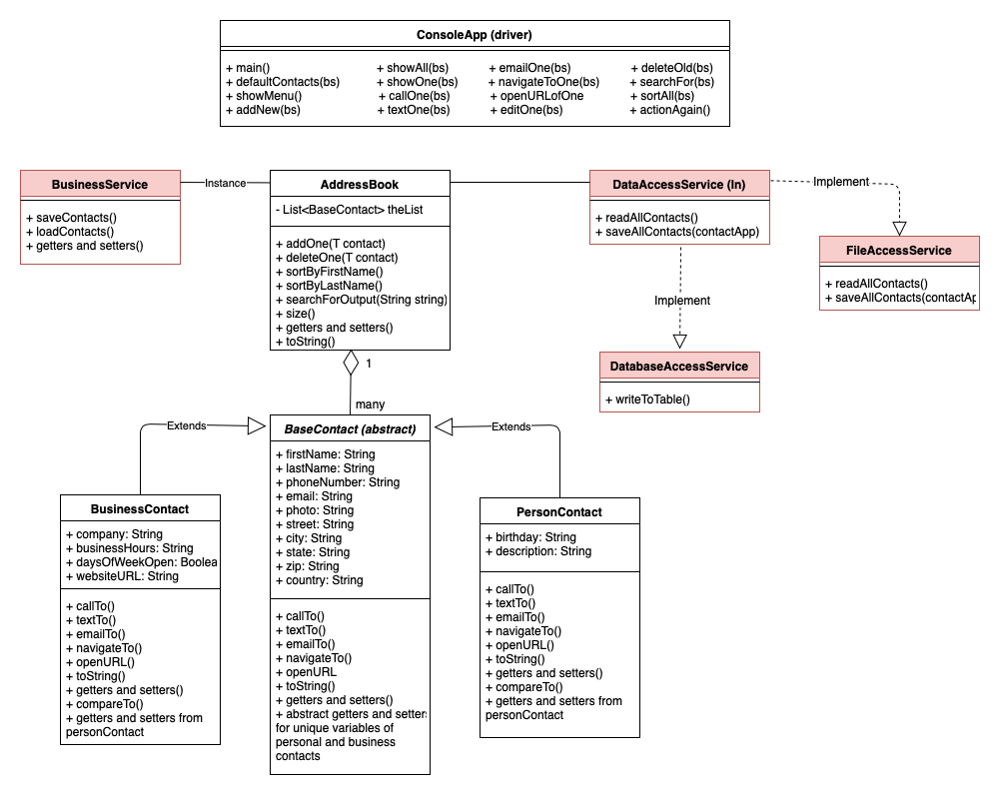
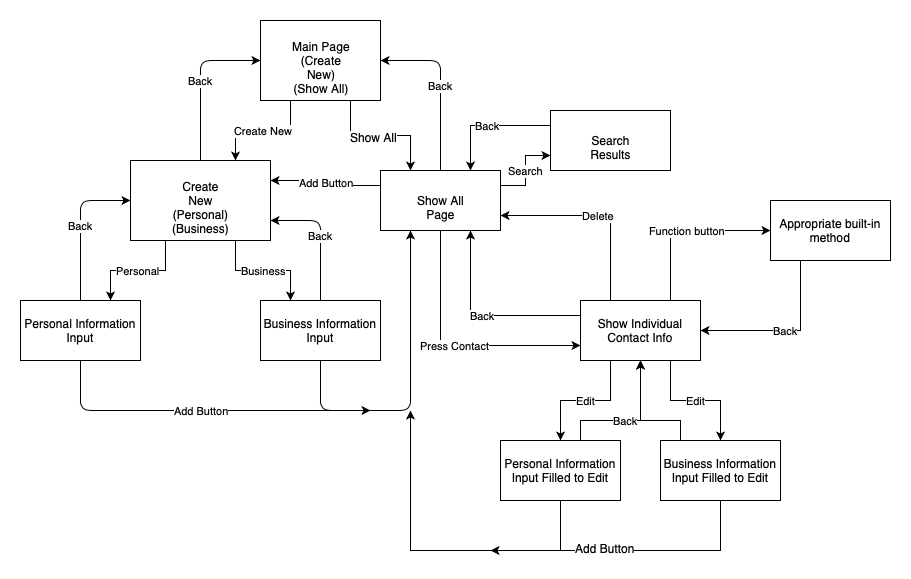
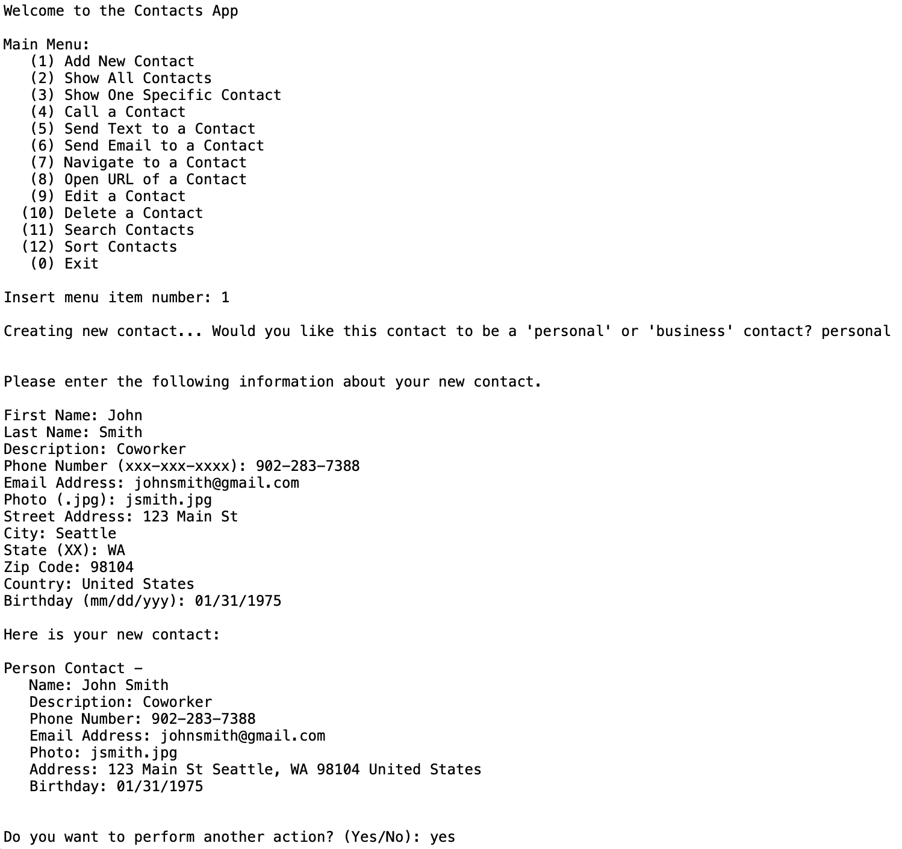
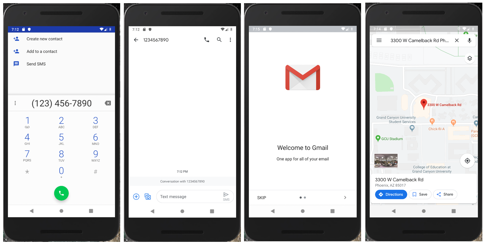

# Contacts Application

Using Android Studio, this application replicates a standard contacts app where a user is able to add, edit, and delete personal and business contacts, as well as search and sort those contacts.

Object oriented concepts such as encapsulation, inheritance, abstract classes, interfaces, overriding/overloading and generics were utilized in this project, following a 7 stage process of:

	1. Design – Planning, UML, Wireframes
	2. Code classes – Creating the properties and methods of each class
	3. Console Application – Create a functioning application that runs in Eclipse
	4. File IO – Save all data to a text file using JSON formatted data
	5. Android GUI layout – Create activities and layouts
	6. Android GUI interaction – Enable buttons, menus, input forms to save, search and display
	7. Android phone functions – Enable phone calls, text, email, navigation using built-in applications

<h2>Design</h2>

The planning for this project included uses tools such as UML diagrams to determine class relationships, wireframes to outline each layout, as well as sitemap for page navigation. Below is a display of each of my UML diagrams and the sitemap used.

<h3>Eclipse UML Diagram</h3>

	

<h3>Android Studio UML Diagram<h3>

	

	
<h3>Sitemap<h3>

	

<h2>Console Application</h2>

Before coding in Android Studio, I used Eclipse to build the foundation of my application. This included all of the functions that the end product would have without the UI design.

<h3>Text-Version of Application<h3>

	

<h2>Final Product</h2>

The final product for this project was a working Android Studio application replicating a contacts app. Below are the wireframes showing the finished design and implemented functions.

<h3>Digital Wireframes<h3>

	

	

<h3>Built-in Phone Functions Applied<h3>

	

